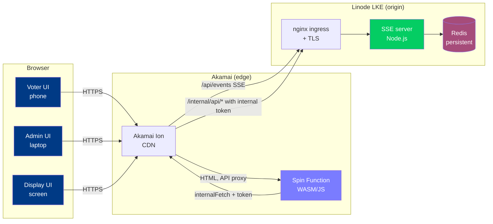
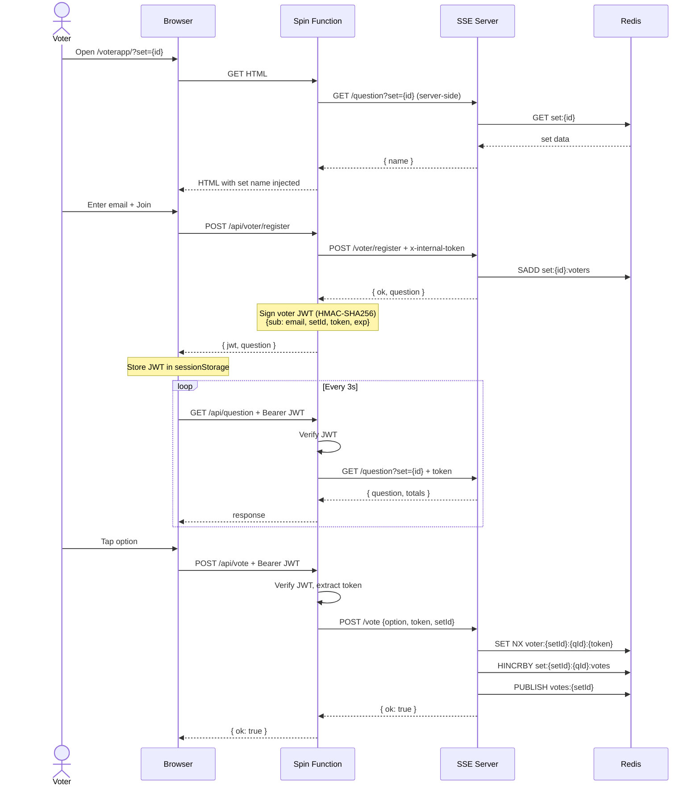
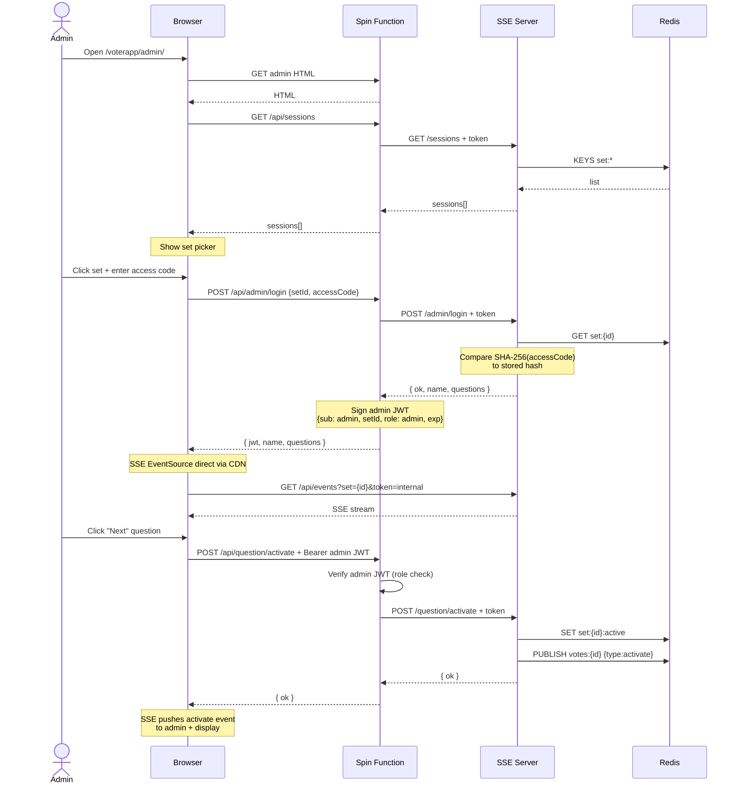
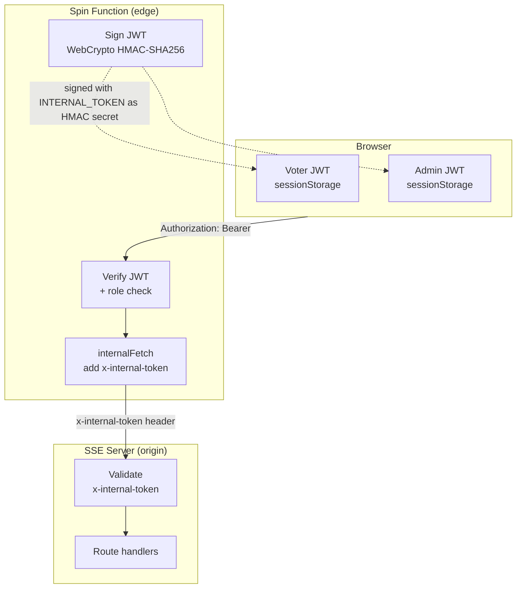
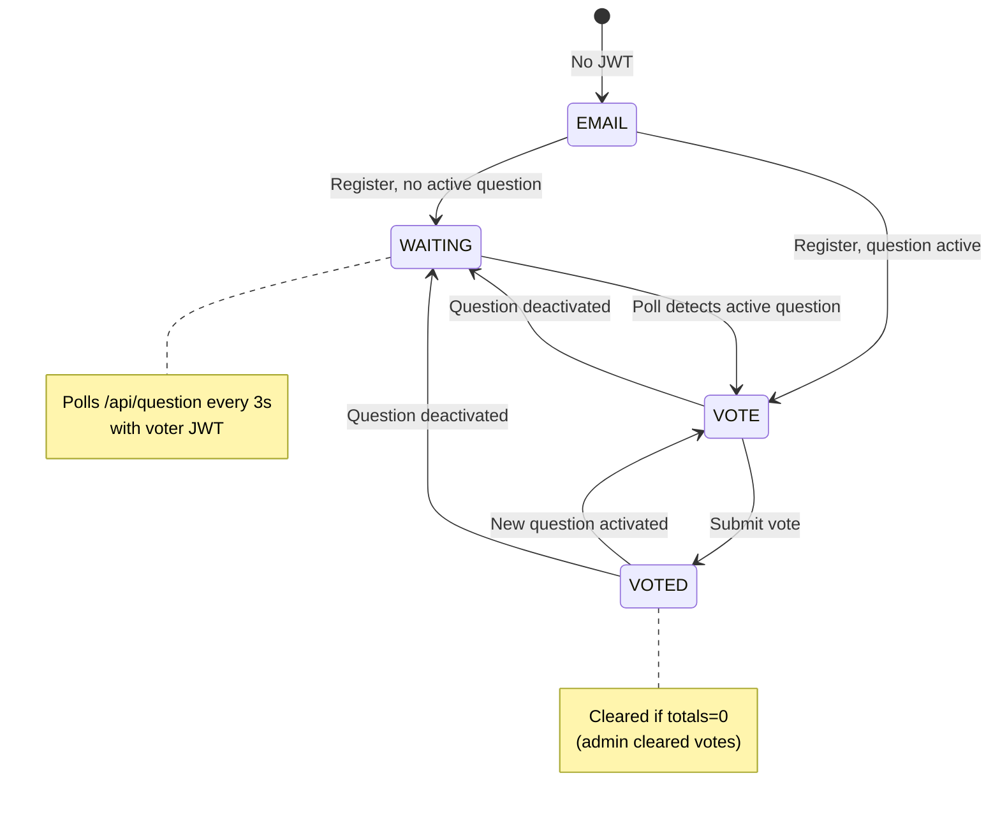

# live-audience-voting

Real-time audience voting system built on Akamai (edge) and Linode Kubernetes Engine (origin). Audience members register with email, vote on their phones, and results appear live on a presenter display as an animated bar chart.

Supports multiple simultaneous question sets, each with multiple questions, scoped voting (one vote per email per question), per-set admin access codes, and live updates via Server-Sent Events.

## System overview



## Components

| Component | Technology | Platform |
|---|---|---|
| Voter UI | HTML/JS served by Spin | Akamai Functions (Fermyon/Spin Wasm) |
| Admin UI | HTML/JS served by Spin | Akamai Functions |
| Display UI | HTML/JS + Chart.js served by Spin | Akamai Functions |
| Edge function | JavaScript (Spin SDK) → Wasm | Akamai Functions |
| SSE server | Node.js / TypeScript | Linode LKE |
| Storage | Redis (Bitnami chart, 1Gi PVC) | Linode LKE (ClusterIP) |
| Ingress | nginx ingress controller | Linode LKE |
| TLS | Let's Encrypt via cert-manager (DNS-01) | Linode webhook |
| CDN | Akamai Ion | Path-based routing, IPACL to LKE |

## Voter flow



## Admin flow



## Auth model



**Three layers of auth:**

1. **Internal token** — shared secret between Function and SSE server. Function adds it on every outbound call. SSE server validates it on all routes except `/health` and `/vote`.
2. **Voter JWT** — issued by Function after email registration. Required on `/api/vote` and `/api/question`. Contains a deterministic dedup token (hash of `setId:email`).
3. **Admin JWT** — issued by Function after access code login. Required on all admin operations (`/api/clear`, `/api/question/activate`, `/api/session/*`). Has `role: "admin"` claim.

The Function handles all JWT logic. The SSE server never sees JWTs — only the internal token.

## Voter state machine



## Repository layout

```
live-audience-voting/
├── README.md                    # This file
├── docs/
│   └── architecture.md          # Detailed architecture, Redis schema, deployment
├── vote-edge-function/          # Spin function (HTML + JS + WASM)
│   ├── src/
│   │   ├── index.js             # Routing, JWT, proxy logic
│   │   ├── config.js            # GITIGNORED — URLs and secrets
│   │   └── config.example.js    # Template
│   ├── html/
│   │   ├── voter.html           # Voter UI with state machine
│   │   ├── admin.html           # Admin UI (set picker → login → control panel)
│   │   ├── display.html         # Presenter display (Chart.js)
│   │   └── styles.css           # Shared stylesheet
│   ├── spin.toml                # Spin manifest
│   └── webpack.config.js
├── sse-server/                  # Node.js SSE server
│   ├── src/index.ts
│   ├── Dockerfile
│   └── package.json
├── k8s/
│   ├── sse-server.yaml          # Deployment + Service
│   ├── sse-ingress.yaml         # nginx ingress + TLS
│   ├── cluster-issuer.yaml      # cert-manager (Let's Encrypt DNS-01)
│   └── redis-values.yaml        # Bitnami Redis Helm overrides (1Gi PVC)
└── loadtest/
    ├── locustfile.py            # Locust test, simulates 300+ voters
    └── README.md                # Test scenarios + monitoring tips
```

## Quick start

1. **Create the first session** (bootstrap via curl — see `docs/architecture.md`)
2. **Build and deploy the edge function:**
   ```bash
   cd vote-edge-function
   cp src/config.example.js src/config.js
   # Edit config.js with your URLs and INTERNAL_TOKEN
   npm install && npm run build && spin aka deploy
   ```
3. **Build and deploy the SSE server:**
   ```bash
   cd sse-server
   docker buildx build --platform linux/amd64,linux/arm64 \
     -t YOUR_DOCKER_USER/sse-server:latest --push .
   kubectl apply -f ../k8s/
   ```
4. **Open the admin UI** at `https://{CDN_HOSTNAME}/voterapp/admin/`, pick the session, log in.

See `docs/architecture.md` for the full setup guide, Redis schema, API reference, and deployment commands.

## Key design decisions

- **Spin function for edge logic** — JWT sign/verify via WebCrypto runs at the edge with sub-millisecond cold starts.
- **All API calls proxied through the function** — except SSE events (CDN buffering would break the stream).
- **JWT auth in the Function, not the SSE server** — keeps the backend simple. SSE server only validates internal token.
- **Voter dedup per question, not per session** — `voter:{setId}:{questionId}:{token}` allows voting on each question once.
- **Voters poll, admin/display use SSE** — phones don't hold long-lived connections; presenter and admin do.
- **Redis with persistence** — sessions and questions survive restarts; vote dedup keys still expire (1h TTL).
- **No secrets in source** — `config.js` gitignored, K8s secrets created via kubectl only.

## License

MIT
